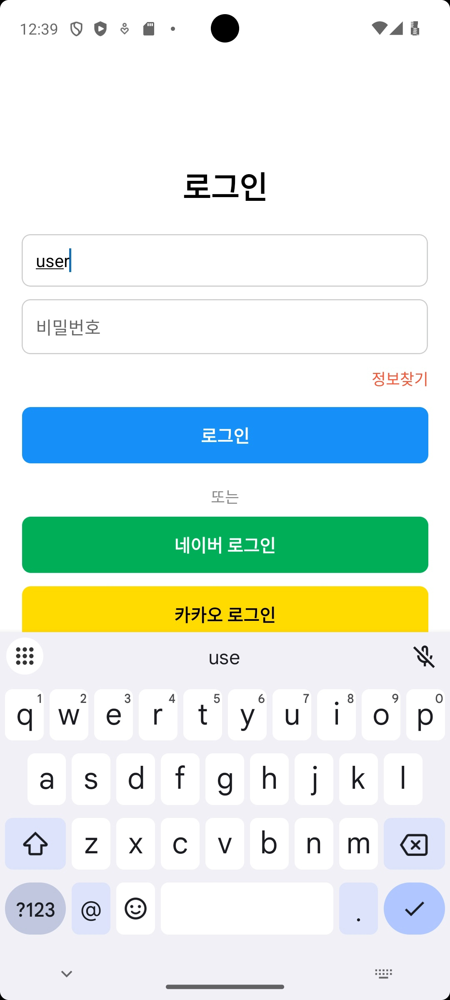
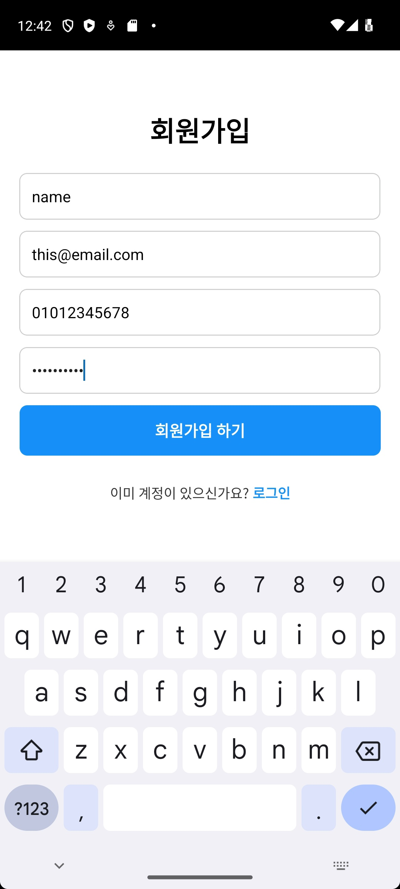
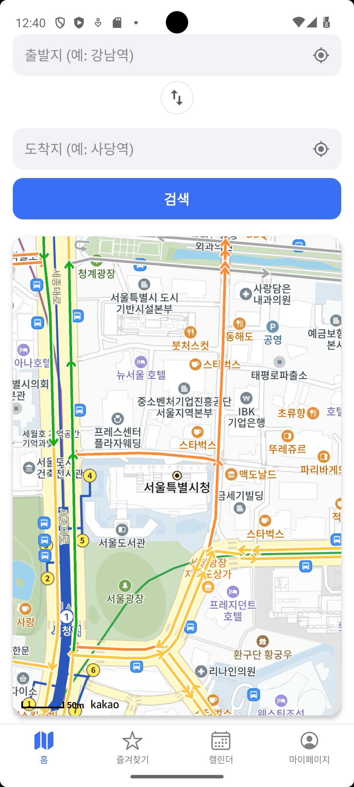
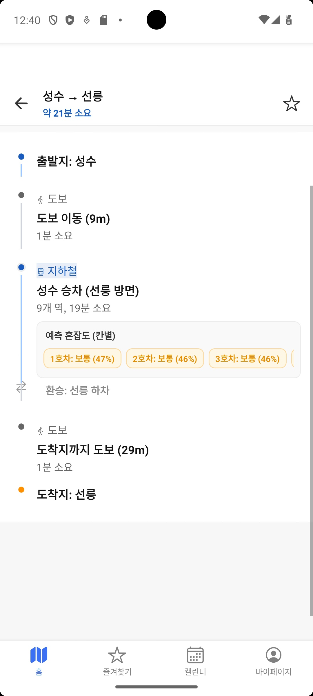

# NORUSH 2025 FE

지하철 혼잡도 기반 경로 추천 서비스 프론트엔드 프로젝트

---

# 📱 주요 기능

- 로그인 / 회원가입
- 경로 검색
- 지하철 혼잡도 확인
- 즐겨찾기 경로 저장
- 마이페이지

---

# 🖥️ 화면 시연

## 로그인

---

## 회원가입

---

## 경로 검색

---

## 경로 상세 (혼잡도 표시)

---

## 즐겨찾기

---

## 마이페이지

---

# 🛠️ 기술 스택

- React Native
- Expo
- TypeScript
- React Navigation

[EXPO 실행](EXPO_STARTED.md#EXPO-실행)
